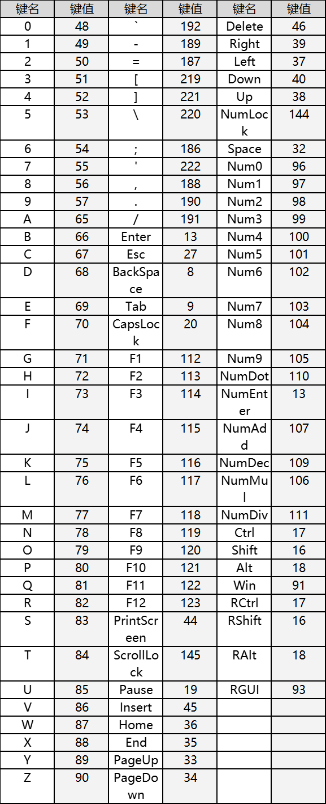

# igkm

这是键盘鼠标模拟输入工具，依赖igkm服务。可远程调本机或者其他机器的硬件输入

## 内容列表

- [依赖](#依赖)
- [快速开始](#快速开始)

## 依赖

- 幽灵键鼠
- igkm服务

## 快速开始

- 在要操作的电脑上插入幽灵键鼠
- 在要操作的电脑上启动igkm.exe（./server/igkm.exe）
- 安装依赖库,使用python调用

```shell
# 安装依赖
pip install -r requirements.txt
```

```python
"""键盘操作; 使用标准接口调用执行方法"""
if __name__ == '__main__':
    from keyboard import Keyboard

    key_action = Keyboard()
    key_action.input_string("123ABC")
    key_action.press_and_release_key_by_code(13)
```

```python
"""键盘操作; 使用封装后的灵活接口"""
if __name__ == '__main__':
    from keyboard import AgileKeyboard

    key_action = AgileKeyboard()
    key_action.send_hotkey("ctrl+alt+delete")
```

```python
"""鼠标操作; 使用标准接口"""
if __name__ == "__main__":
    from mouse import Mouse
    mouse_action = Mouse()
    mouse_action.press_and_release_mouse(code="1")
```

### 键盘参照


